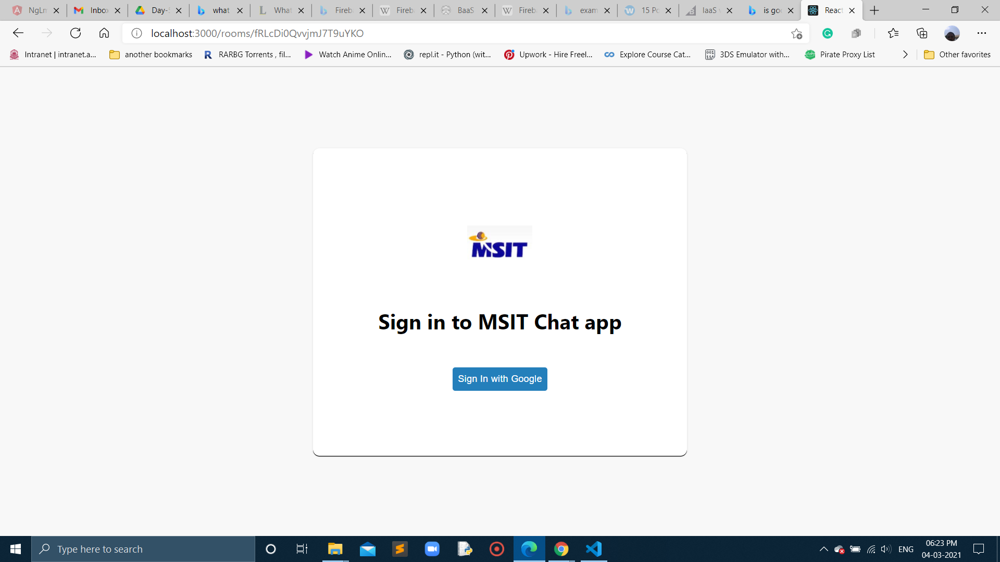
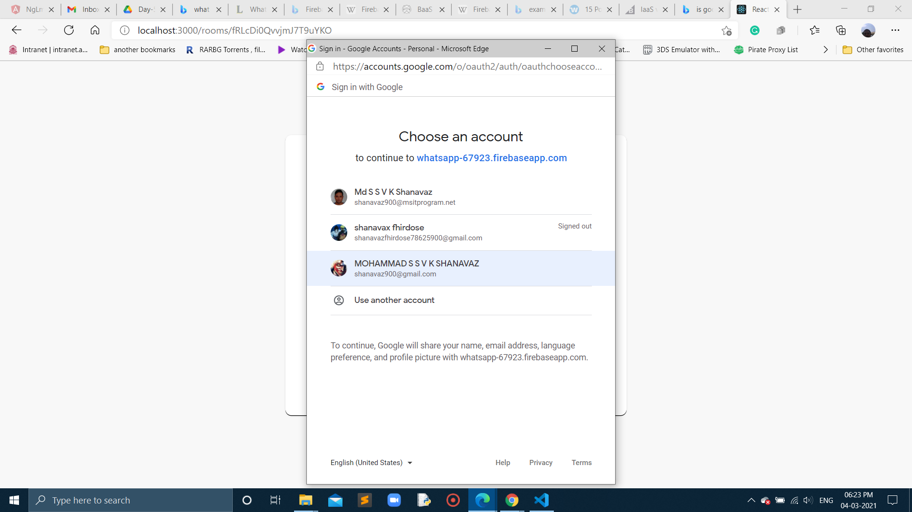
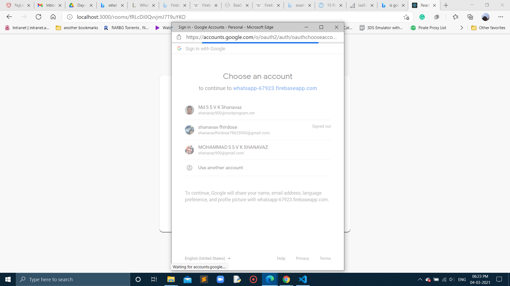
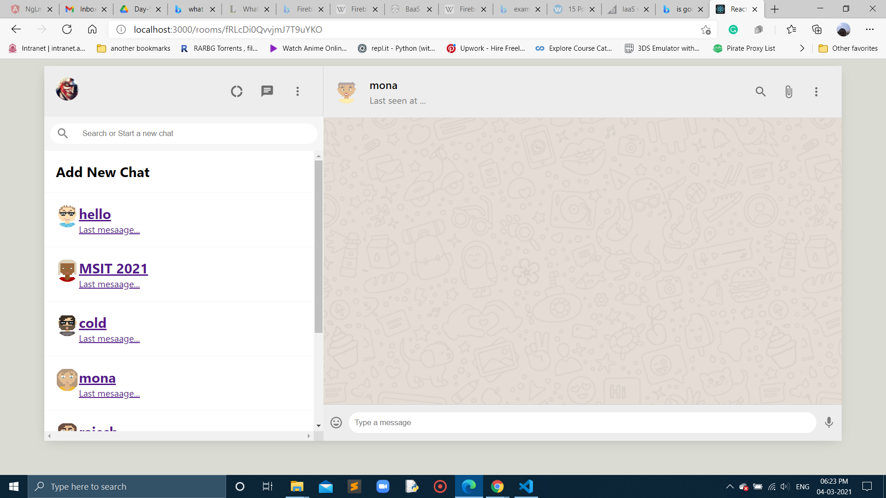

## In Day-6 on login-page-with-redux branch:
- able to add login page

## here is the video for login page:
https://drive.google.com/file/d/1aIANpAMobMaXA-F4Q-WL_HgPDuiMDcRT/view?usp=sharing

- google authentication

## here is the video link for authentication with firebase:
https://drive.google.com/file/d/14yrWmbnFK04ZjaS6qEiFmE2slPS1UCft/view?usp=sharing

- seperate user avatar chat room

## Need to install react-dom-router for acessing browser,route,switch,useparams :
https://www.npmjs.com/package/react-router-dom
- Here is the command at terminal: npm i react-router-dom

## At last authentication between login page and chat page created successfully.
