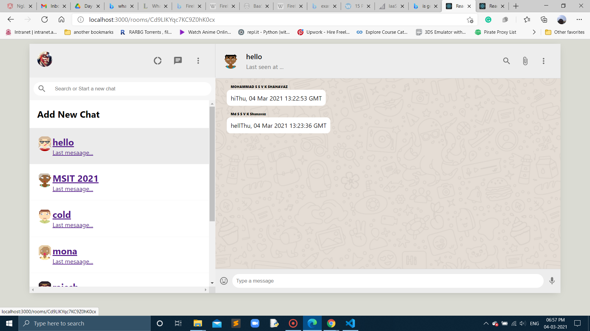
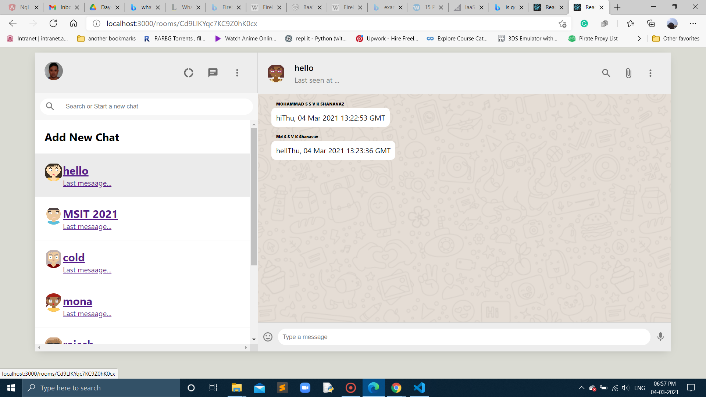

## In Day-7 on show-messages-based-on-room branch
- Able to add meesages for differnt users
- Here is the images for different users:

- Able to send and recieve messages effectively on different users to different chat rooms

## Day-7 workdone successfully
