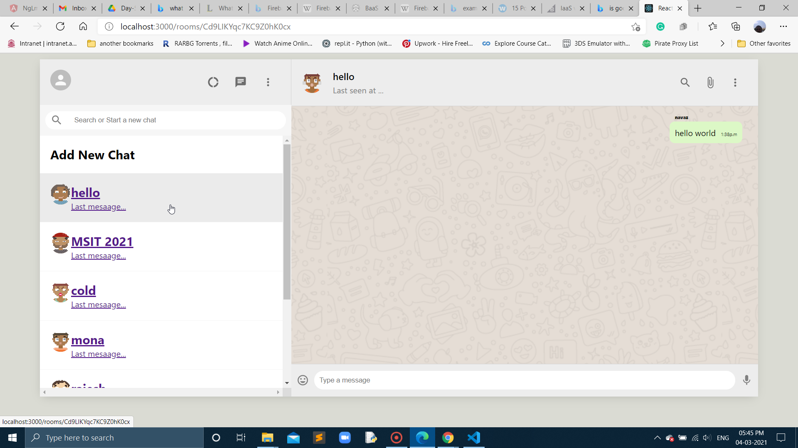
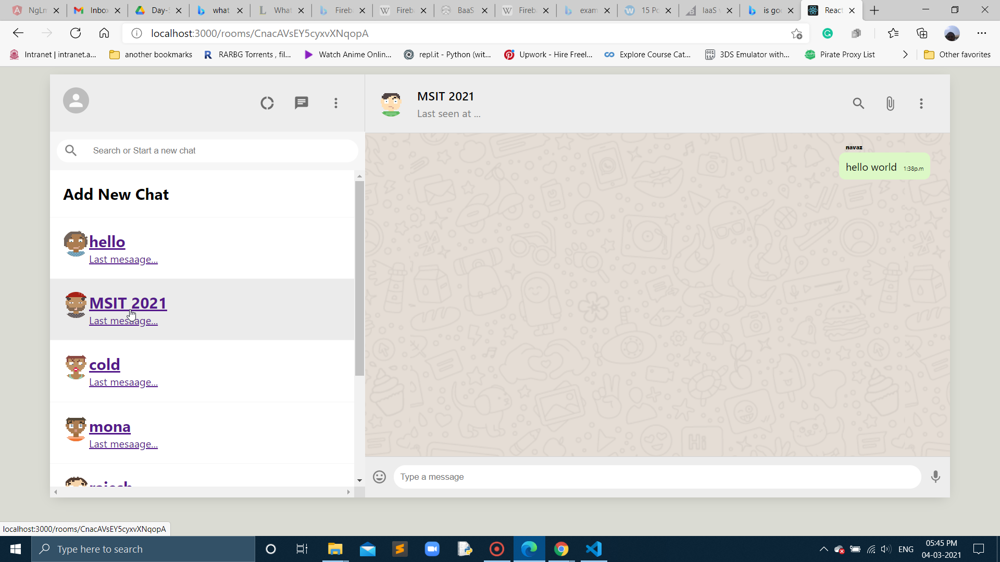

## In Day-5 of show-messages-based-on-chat-room branch

- Able to access to each and every room seperately
- Here is the Image:

## Here is another room with seperate chat room with its name and message:

