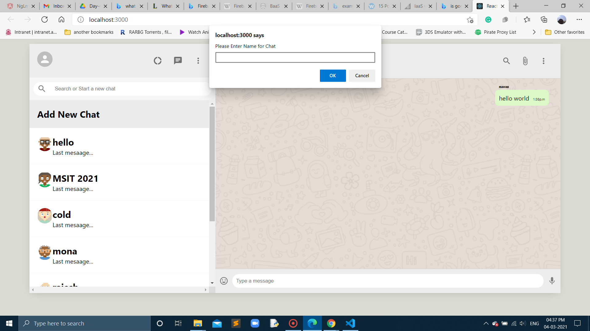

## In Day-4 at adding-firebase-database

## To install firebase dependicies in our project:

- here is the command " npm i firebase " at the terminal

## Here is the video on adding database to the project:

https://drive.google.com/file/d/1rM2l8kldpl_lgSfysXT2G0UHiCpnpBA_/view?usp=sharing

## Here is the video of adding in the firebase website for firebase database:

https://drive.google.com/file/d/1OGZz9lCZGT9nM673r59nzAyYQ1UoAR4c/view?usp=sharing

## Here is the image for adding rooms at the sidebar component:

