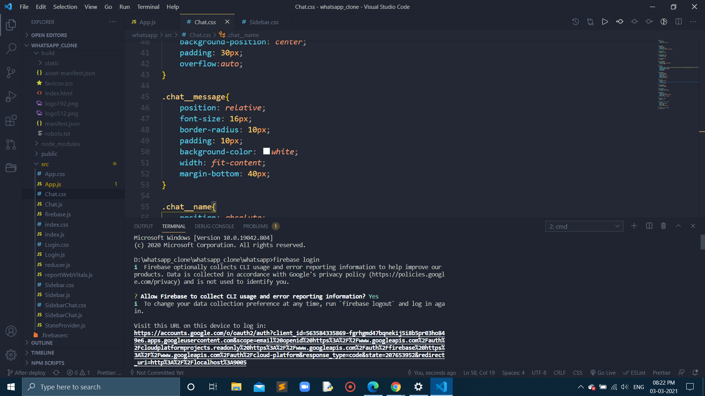
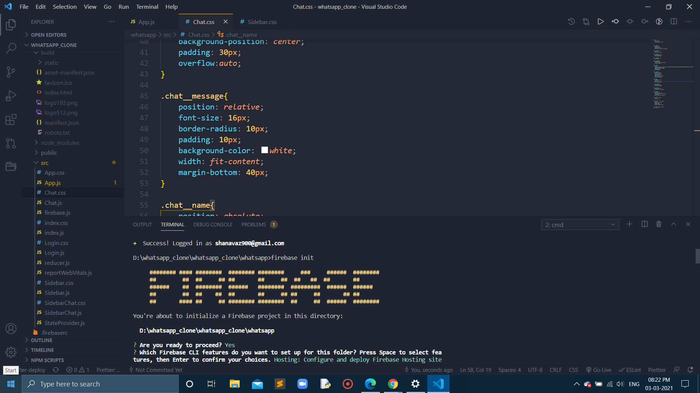
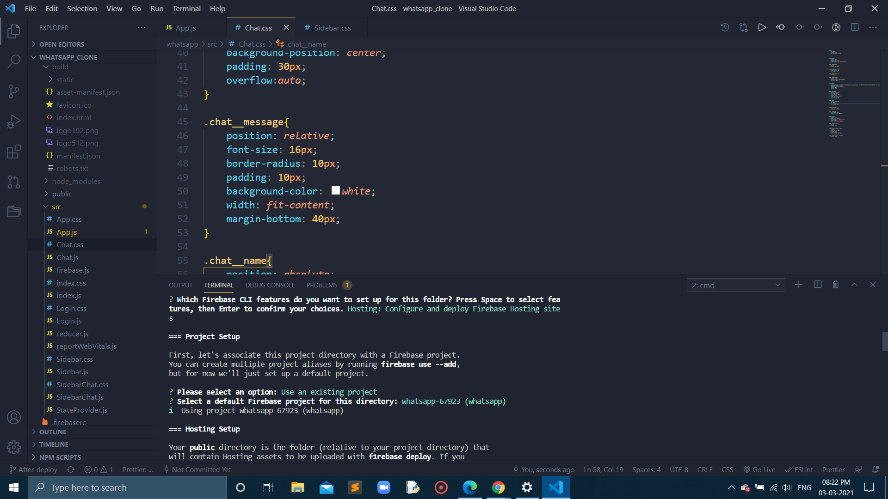
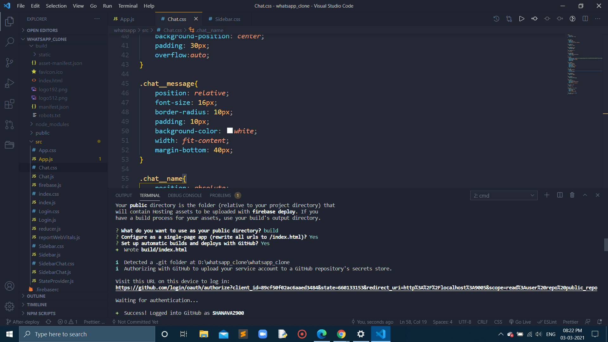
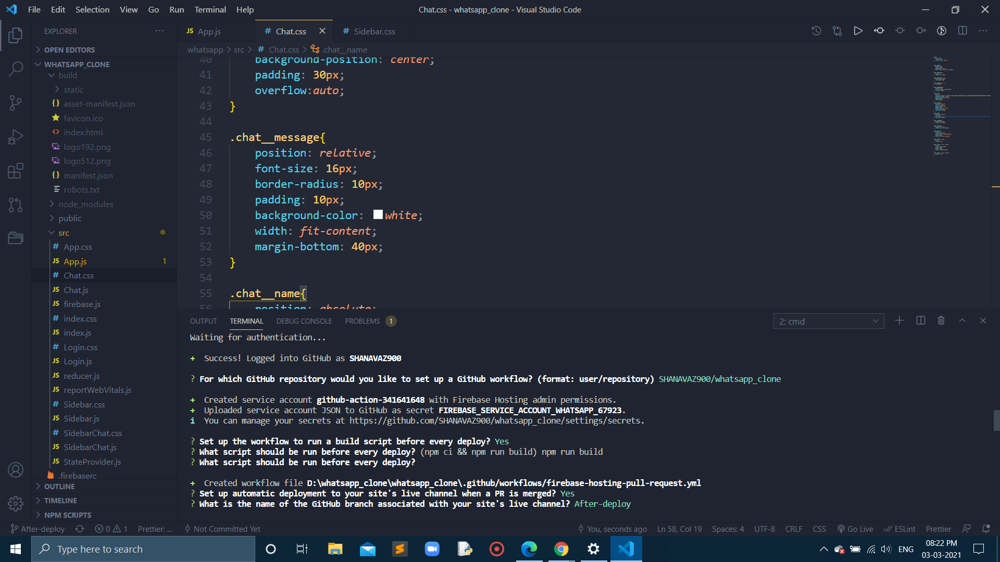
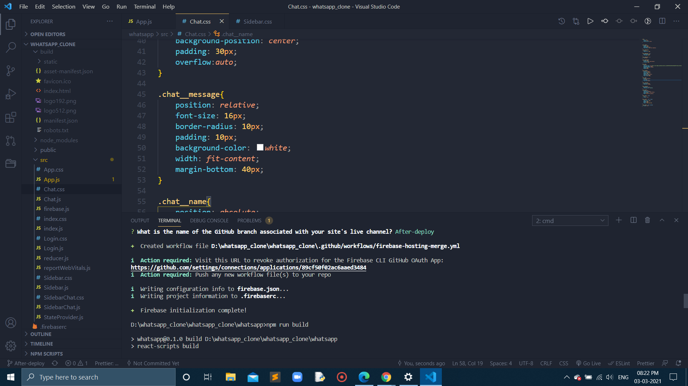
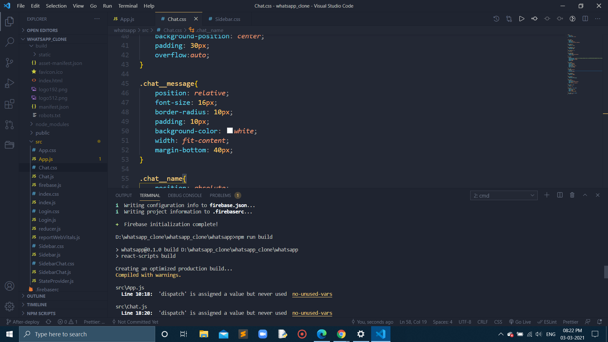
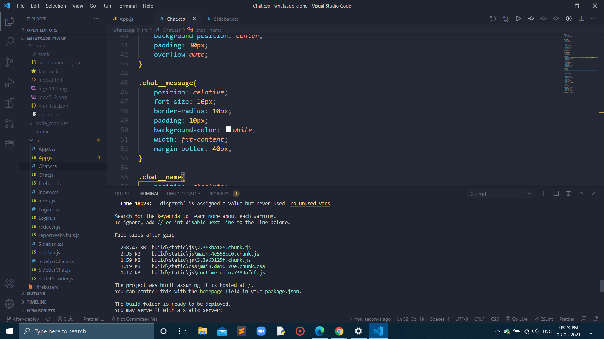
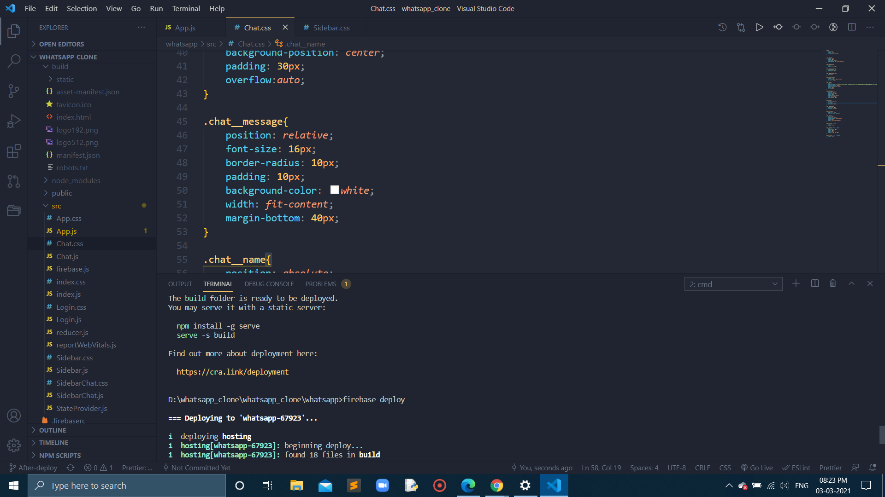
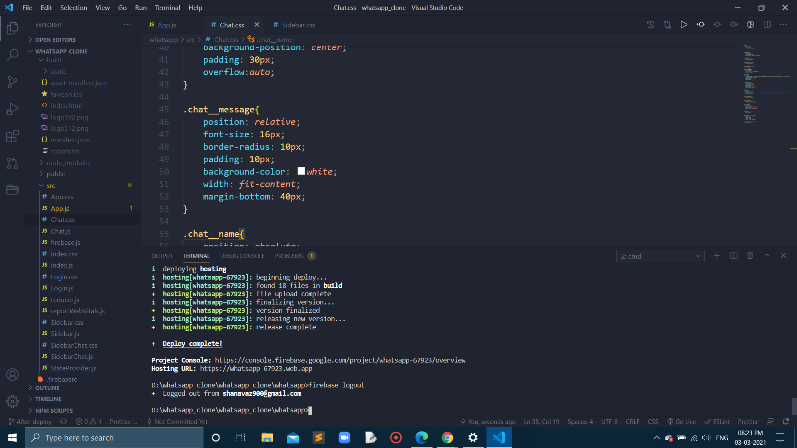

## In Day-10 on After-deploy Branch

## Here is the neccessary changes done on the web chat app:

- As you see scaling of the app done on sidebar as well as chat components
- Also able to show the user send and recieve messages effectively for different users

Here is the deplyement order of the image using firebase at the terminal:
## Firebase login
- 
## Firebase init
- 
- 
- 
- 
- 
## npm run build
- 
- 
- 
## logout from Firebase
- 

## Shown the deployement successfully.

## Web Chat App work done Successfully.

# Thank You for everyone in advance who is going to visit this project.

