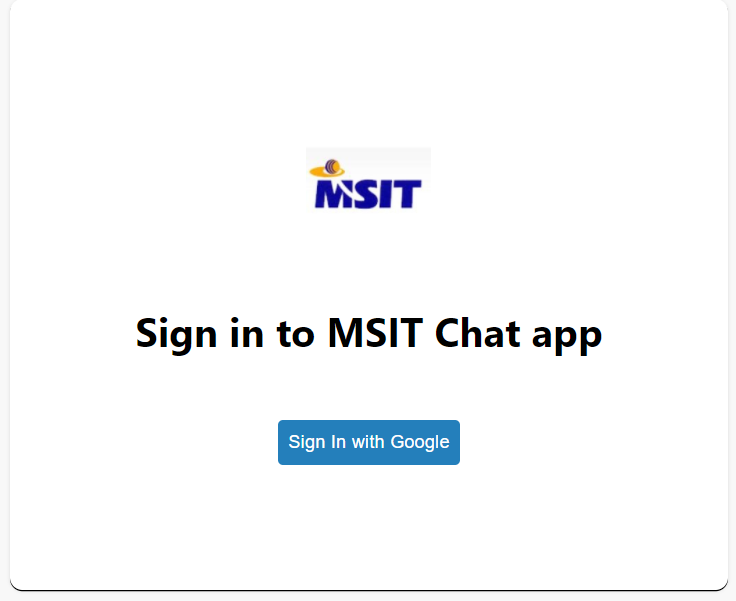
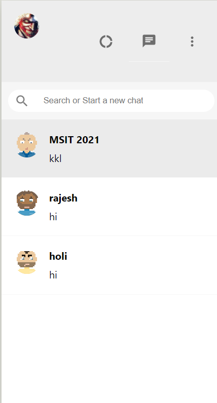
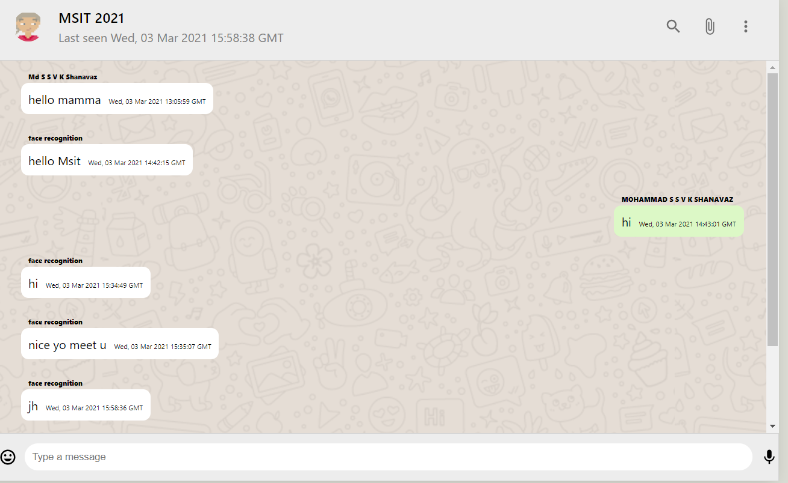
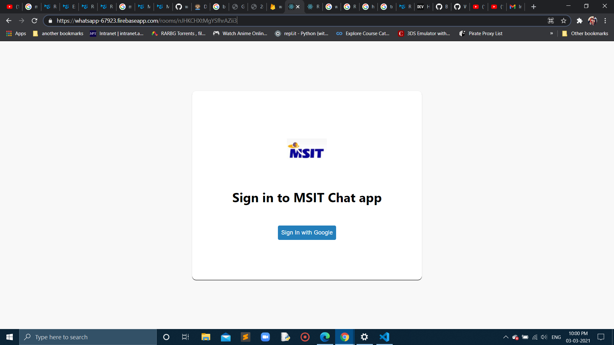
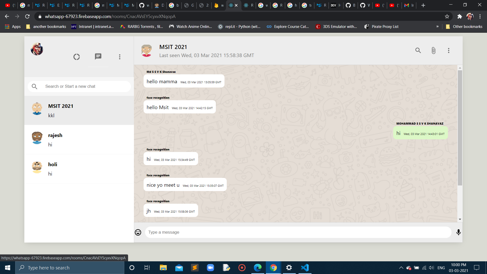
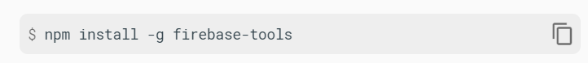
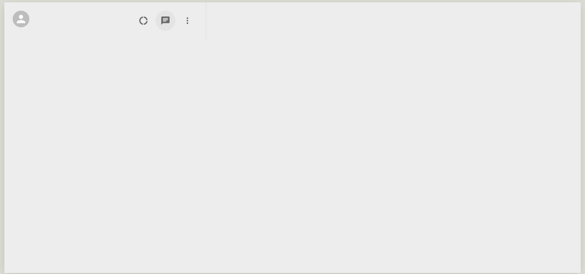

# TO Build a Whatsapp_clone alias MSIT Chat App with ReactJs ,Firebase ,Google Authentication.

## RoadMap for the project as follows:

- login page

- sidebar

- chat session

## Also the respective branches used in this project:
- main
- day-2
- day-3
- adding-firebase-database
- show-messages-based-on-chat-room
- login-page-with-redux
- show-messages-based-on-room
- show-sidebar-last-message-from-the-database
- Before-deploy
- After-deploy

## After Deployement the Chat App for Website looks like this:https://whatsapp-67923.firebaseapp.com/

Here are some images after deployement:

## complete deployed web app video:

Here is:https://drive.google.com/file/d/135Ge6opJuO-gideftFFk_6RIOoEmA65l/view?usp=sharing

## According to the roadmap in the main branch :
react app intall:npx create-react-app project name
In this my project name is whatsapp
After folder is created we have to go into project folder:whatsapp
command:cd whatsapp in the terminal.

## my first day task is:
To add avatars using material UI and here is the installation command:npm install @material-ui/core
website Link:https://material-ui.com/
or npm i @material-ui/core

-Icons:
used:https://material-ui.com/components/icons/#icons
commands:npm install @material-ui/icons or
npm i @material-ui/icons
After icons you can choose whatever icons can be imported from the project

Coming to Firebase 
- Its a Google-backed application development software that enables developers to develop iOS, Android and Web apps. 
- Firebase provides tools for tracking analytics, reporting and fixing app crashes, creating marketing and product experiment.
- Its free for all of these features. 
- Firebase also has many free products: Analytics, Cloud Messaging, the Notifications composer, Remote Config, App Indexing, Dynamic Links, and Crash Reporting.
-  You can use an unlimited amount of any of these products in all plans, including our free Spark plan.
-  Here is the Website link:https://firebase.google.com/

Here is the video firebase login through my account:https://drive.google.com/file/d/1qxOzRKoUQQIBUgXKZ_G9yB95JnuodRkE/view?usp=sharing

For installing firebase at the terminal:

For deploying Firebase at the Terminal:

Also my first day completion in the Main branch video:https://drive.google.com/file/d/16uEmqemvyJheZbYQzmVmF-kUyj-NIUdz/view?usp=sharing

### Also my first day completion image:

#### So,my first day of my project is completed as shown in above images and videos

