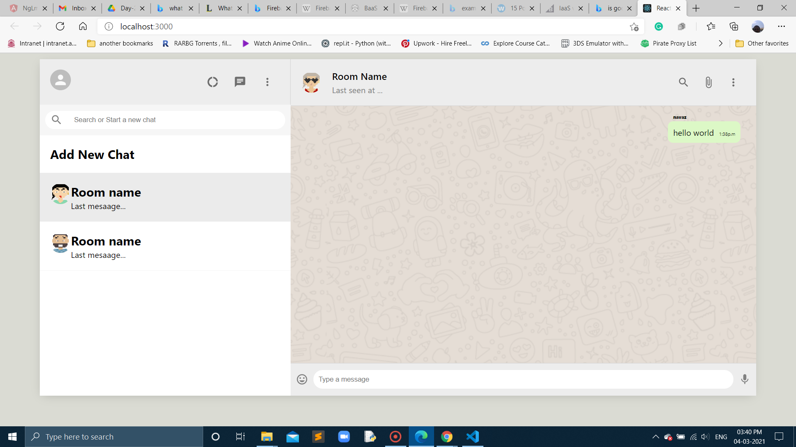
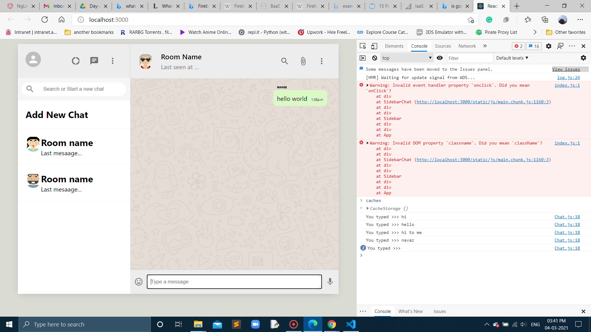

# In day-3 branch

- able to add chat and sidebar components

## Here is the image of chat and sidebar components:

## Here is the web chat app with console accepting messages:

## Also used random avator API's:

https://avatars.dicebear.com/

## What is SVG?
- SVG stands for Scalable Vector Graphics
- SVG is used to define vector-based graphics for the Web
- SVG defines the graphics in XML format
- Every element and every attribute in SVG files can be animated
- SVG is a W3C recommendation
- SVG integrates with other W3C standards such as the DOM and XSL
- Here is the API URL for generating random avatars:https://avatars.dicebear.com/api/human/{seed}.svg
- in this seed you can type anything like 123,786,$123 which generates diffrent avatars acoording to the given API.

## Here is the video:https://drive.google.com/file/d/1oOajSV3pMqKd_FCfXPAq0l0nZ1iEQDF2/view?usp=sharing
