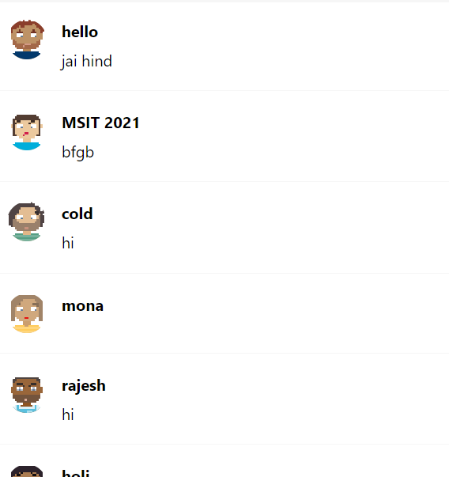
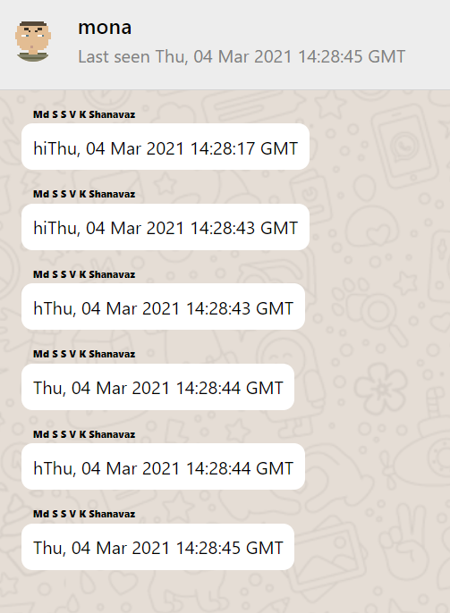

## In Day-8 on show-sidebar-last-message-from-the-database Branch:

- ## Able to add timestamp and last seen messages on sidebar and chat components
- Also need to do some changes on overall before going to deployement

## Here is the Image for last seen message in sidebar:

## Here is the Image for last seen message in chat with timestamp:

## Able to add last seen and timestamp successfully
